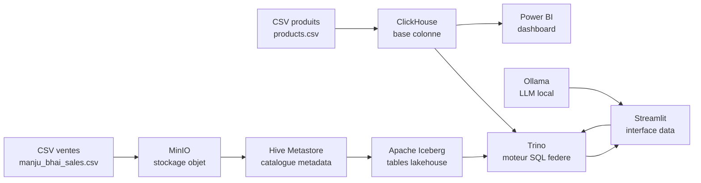

# Rapport de Projet - Data Lakehouse, Trino, GenAI et Power BI

## 1. Introduction

Ce projet presente la mise en place d'une architecture moderne de donnees en local. L'objectif est de construire une plateforme capable de stocker des donnees dans un Data Lakehouse, de les interroger avec un moteur SQL federe, de proposer une interface web d'exploration, d'utiliser un modele IA local pour generer des requetes SQL, et de produire un dashboard Power BI sur un deuxieme dataset.

La solution a ete construite avec Docker afin d'avoir une architecture reproductible, locale et independante des services cloud. Elle combine plusieurs briques techniques utilisees dans les architectures modernes de donnees: MinIO, Hive Metastore, PostgreSQL, Apache Iceberg, Trino, ClickHouse, Ollama, Streamlit et Power BI.

## 2. Objectifs du projet

Les objectifs principaux sont les suivants:

- Mettre en place une architecture Data Lakehouse locale.
- Stocker les donnees brutes dans un stockage objet compatible S3.
- Organiser les donnees analytiques avec Apache Iceberg.
- Interroger plusieurs sources avec un seul moteur SQL: Trino.
- Utiliser ClickHouse pour un dataset analytique rapide dedie a Power BI.
- Creer une interface Streamlit pour explorer les catalogues, schemas, tables et donnees.
- Ajouter un assistant Text-to-SQL base sur un modele LLM local via Ollama.
- Produire un tableau de bord Power BI connecte a ClickHouse.
- Garder tout le projet executable localement avec Docker Compose.

## 3. Solution proposee

La solution repose sur une architecture Data Lakehouse locale.

Les donnees brutes sont chargees dans MinIO. Trino lit ces donnees via un catalogue Hive et les transforme en tables Apache Iceberg. Les metadonnees des tables sont stockees dans Hive Metastore, lui-meme connecte a PostgreSQL.

En parallele, un dataset produit different est charge dans ClickHouse. Ce dataset est utilise pour Power BI, car ClickHouse est adapte aux requetes analytiques rapides et aux tableaux de bord interactifs.

Streamlit joue le role d'interface utilisateur. Il permet d'explorer les catalogues Trino, de consulter les tables Iceberg, d'observer les partitions et d'utiliser un assistant IA local. L'assistant IA utilise Ollama avec le modele `qwen2.5-coder:1.5b` pour transformer une question metier en requete SQL compatible Trino.

Power BI se connecte a ClickHouse pour produire des visualisations sur le dataset `products.csv`.

## 4. Architecture globale



Cette architecture separe clairement les responsabilites:

- MinIO stocke les fichiers et les tables lakehouse.
- Hive Metastore conserve les metadonnees.
- Iceberg structure les donnees analytiques.
- Trino interroge les sources de donnees.
- ClickHouse sert les donnees de reporting Power BI.
- Streamlit expose une interface simple pour explorer et interroger.
- Ollama fournit la partie IA locale.
- Power BI produit la visualisation finale.

## 5. Architecture technique par composant

| Composant | Role dans le projet | Port local |
|---|---|---|
| MinIO | Stockage objet compatible S3 pour les donnees du lakehouse | 9000, 9001 |
| PostgreSQL | Base relationnelle pour Hive Metastore | 5432 |
| Hive Metastore | Catalogue de metadonnees pour Hive et Iceberg | 9083 |
| Trino | Moteur SQL federe | 8080 |
| ClickHouse | Base analytique rapide pour Power BI | 8123, 9002 |
| Ollama | Serveur LLM local | 11434 |
| Streamlit | Interface web du projet | 8501 |
| Power BI | Dashboard final connecte a ClickHouse | Application desktop |

## 6. Stockage et organisation des donnees

Le projet utilise deux datasets:

1. `data/manju_bhai_sales.csv`
   - utilise pour la partie Data Lakehouse;
   - charge dans MinIO;
   - transforme en tables Hive puis Iceberg;
   - interroge avec Trino.

2. `data/products.csv`
   - utilise pour la partie ClickHouse et Power BI;
   - charge dans ClickHouse;
   - transforme en tables analytiques pre-agregees pour Power BI.

Cette separation respecte la demande du projet: utiliser un autre dataset pour la partie ClickHouse et Power BI.

## 7. Pipeline Data Lakehouse

Le pipeline Data Lakehouse suit les etapes suivantes:

1. Les fichiers CSV sont places dans le dossier `data/`.
2. Le service `minio-init` cree le bucket `warehouse` dans MinIO.
3. Les fichiers sont copies dans MinIO:
   - `raw/people/people.csv`
   - `raw/sales/manju_bhai_sales.csv`
4. Trino cree des tables externes Hive sur les fichiers CSV.
5. Trino transforme les donnees brutes en tables Apache Iceberg au format Parquet.
6. Une table partitionnee est creee pour optimiser les requetes.
7. Une table agreggee est creee pour resumer les ventes par ville et canal.

Le script principal de creation est:

```text
scripts/init_lakehouse.sql
```

## 8. Tables Data Lakehouse creees

Tables Hive brutes:

- `hive.raw.people_csv`
- `hive.raw.sales_csv`

Tables Iceberg:

- `iceberg.lakehouse.people`
- `iceberg.lakehouse.sales`
- `iceberg.lakehouse.sales_partitioned`
- `iceberg.lakehouse.sales_city_summary`

La table `iceberg.lakehouse.sales_partitioned` est partitionnee par:

- `city`
- `channel`

Cette partition permet d'ameliorer les performances lorsque les requetes filtrent ou regroupent par ville ou par canal de vente.

## 9. Pipeline ClickHouse et Power BI

ClickHouse est utilise pour le dataset `products.csv`, qui contient des informations produits comme:

- identifiant produit;
- nom produit;
- description;
- categorie;
- sous-categorie;
- marque;
- prix;
- note moyenne;
- nombre d'avis;
- quantite en stock;
- date d'ajout.

Le fichier est charge dans la table:

```text
analytics.products
```

Ensuite, plusieurs tables analytiques sont creees pour faciliter le reporting Power BI:

- `analytics.powerbi_product_kpi_overview`
- `analytics.powerbi_product_category_summary`
- `analytics.powerbi_product_brand_summary`
- `analytics.powerbi_product_stock_summary`
- `analytics.powerbi_product_timeline`

Ces tables preparent deja les indicateurs principaux:

- nombre total de produits;
- nombre de categories;
- nombre de marques;
- prix moyen;
- note moyenne;
- total des avis;
- stock total;
- valeur d'inventaire;
- repartition par categorie;
- repartition par marque;
- evolution temporelle des produits.

## 10. Role de Trino

Trino est le moteur central du projet. Il permet d'interroger plusieurs systemes avec le meme langage SQL.

Les catalogues configures sont:

| Catalogue Trino | Source connectee | Utilisation |
|---|---|---|
| `hive` | Hive Metastore + MinIO | Lecture des fichiers CSV bruts |
| `iceberg` | Hive Metastore + MinIO | Tables lakehouse au format Iceberg |
| `clickhouse` | ClickHouse | Requetes federees sur les donnees produits |
| `postgresql` | PostgreSQL | Acces a la base du metastore |

Trino permet donc d'avoir un point d'entree SQL unique pour interroger les donnees, meme si elles sont stockees dans differents moteurs.

## 11. Role de MinIO

MinIO remplace un service cloud de type Amazon S3 dans un environnement local.

Dans ce projet, MinIO stocke:

- les fichiers CSV bruts;
- les fichiers Parquet produits par les tables Iceberg;
- les donnees physiques du Data Lakehouse.

Le bucket principal est:

```text
warehouse
```

L'interface MinIO est disponible sur:

```text
http://localhost:9001
```

Identifiants:

```text
user: minioadmin
password: minioadmin
```

## 12. Role du Hive Metastore

Hive Metastore conserve les metadonnees des tables:

- noms des schemas;
- noms des tables;
- colonnes;
- types de donnees;
- emplacements physiques dans MinIO;
- informations de partitions;
- metadonnees Iceberg.

Le metastore utilise PostgreSQL comme base interne. PostgreSQL ne stocke pas les donnees analytiques, il stocke seulement les informations de catalogue.

## 13. Role d'Apache Iceberg

Apache Iceberg est le format lakehouse du projet. Il apporte une organisation plus moderne que des fichiers CSV simples.

Avantages d'Iceberg dans ce projet:

- stockage en Parquet;
- structure de table claire;
- metadonnees de table;
- snapshots;
- partitions;
- meilleure performance que les CSV bruts;
- integration avec Trino.

La page Streamlit `Produits de donnees` permet d'observer certaines metadonnees Iceberg comme les partitions et les snapshots.

## 14. Role de ClickHouse

ClickHouse est une base de donnees colonne optimisee pour l'analyse rapide.

Dans ce projet, ClickHouse sert la partie Power BI. Les donnees produits y sont chargees et preparees sous forme de tables de reporting.

La table principale utilise le moteur:

```text
MergeTree
```

Elle est partitionnee par mois avec:

```text
toYYYYMM(date_added)
```

Elle est triee par:

```text
category, subcategory, brand, product_id
```

Ce choix permet de rendre les analyses plus rapides sur les categories, sous-categories et marques.

## 15. Interface Streamlit

L'interface Streamlit permet de rendre la plateforme accessible sans utiliser directement la ligne de commande.

Elle contient quatre pages:

### Accueil

La page d'accueil presente:

- l'etat de Trino;
- l'etat d'Ollama;
- le nombre de catalogues Trino;
- le nombre de schemas Iceberg;
- le nombre de tables lakehouse;
- la liste des catalogues;
- la liste des tables Iceberg.

### Explorateur de schemas

Cette page permet de:

- choisir un catalogue;
- choisir un schema;
- choisir une table;
- afficher les colonnes;
- afficher un apercu des donnees.

Elle est utile pour comprendre rapidement la structure des donnees disponibles.

### Produits de donnees

Cette page est dediee aux tables Iceberg.

Elle permet de consulter:

- la structure de la table;
- le volume de donnees;
- un apercu des lignes;
- les partitions Iceberg;
- les snapshots Iceberg.

### Assistant SQL

Cette page permet de poser une question en langage naturel.

Le fonctionnement est le suivant:

1. l'utilisateur choisit le catalogue, le schema et la table;
2. l'application recupere automatiquement les colonnes de la table;
3. un prompt est construit pour le modele IA;
4. Ollama genere une requete SQL;
5. l'application verifie que la requete est en lecture seule;
6. Trino execute la requete;
7. le resultat est affiche dans Streamlit.

## 16. Partie GenAI et Text-to-SQL

La partie GenAI repose sur Ollama.

Le modele utilise est:

```text
qwen2.5-coder:1.5b
```

Ce choix est important car un modele plus lourd, comme un modele 7B, consomme beaucoup plus de RAM. Dans une architecture locale qui execute deja Trino, ClickHouse, PostgreSQL, MinIO et Hive Metastore, un modele trop lourd peut provoquer des erreurs memoire.

Le modele 1.5B est donc un compromis entre:

- performance;
- consommation memoire;
- capacite a generer du SQL;
- stabilite locale.

La securite de base est assuree par une verification de la requete generee. L'application refuse les requetes qui commencent par des operations dangereuses comme:

- `DROP`
- `DELETE`
- `UPDATE`
- `INSERT`
- `ALTER`
- `CREATE`
- `TRUNCATE`

L'objectif est de permettre seulement des requetes de lecture.

## 17. Power BI

Power BI est connecte a ClickHouse en mode DirectQuery.

Parametres de connexion:

```text
Host: localhost
Port: 8123
Database: analytics
Mode: DirectQuery
Username: default
Password: clickhouse
```

Tables utilisees dans Power BI:

- `products`
- `powerbi_product_kpi_overview`
- `powerbi_product_category_summary`
- `powerbi_product_brand_summary`
- `powerbi_product_stock_summary`
- `powerbi_product_timeline`

Le fichier Power BI est:

```text
powerbi/PowerBI.pbix
```

Cette partie montre que le projet ne se limite pas au stockage et aux requetes SQL, mais qu'il va jusqu'a la visualisation metier.

## 18. Automatisation du projet

Le script principal est:

```powershell
.\scripts\setup_all.ps1
```

Il automatise:

- le demarrage des conteneurs Docker;
- la preparation de MinIO;
- l'import dans ClickHouse;
- la creation des tables Hive;
- la creation des tables Iceberg;
- le telechargement du modele Ollama.

Le dashboard Streamlit se lance avec:

```powershell
.\scripts\run_dashboard.ps1
```

Les requetes de demonstration se lancent avec:

```powershell
.\scripts\run_demo_queries.ps1
```

## 19. Validation technique

La stack Docker a ete verifiee avec les services suivants en execution:

- MinIO;
- PostgreSQL;
- Hive Metastore;
- Trino;
- ClickHouse;
- Ollama.

Les validations realisees:

- Trino repond aux requetes SQL.
- ClickHouse repond aux requetes analytiques.
- Streamlit est accessible sur `http://localhost:8501`.
- Power BI est connecte a ClickHouse.
- La table Iceberg partitionnee contient `5 576 637` lignes.
- La table ClickHouse `analytics.products` contient `1 000` lignes.

## 20. Points forts de la solution

Les points forts du projet sont:

- architecture complete et locale;
- separation entre data lakehouse et reporting rapide;
- utilisation d'un moteur SQL federe;
- stockage moderne avec Iceberg;
- integration d'un LLM local;
- dashboard Streamlit utilisable par un utilisateur non technique;
- integration Power BI;
- automatisation avec scripts PowerShell;
- projet reproductible avec Docker Compose.

## 21. Limites et ameliorations possibles

Quelques ameliorations possibles:

- ajouter une couche d'orchestration avec Airflow ou Dagster;
- ajouter des tests de qualite de donnees;
- ajouter une authentification sur Streamlit;
- ajouter plus de mesures DAX dans Power BI;
- creer un theme Power BI plus avance;
- ajouter une gestion plus stricte des droits Trino;
- ajouter un vrai pipeline incremental;
- journaliser les questions posees a l'assistant SQL;
- ajouter une page Streamlit dediee aux indicateurs ClickHouse.

## 22. Conclusion

Ce projet met en place une architecture moderne de donnees de bout en bout. Il montre comment construire localement une plateforme capable de stocker, organiser, interroger, explorer et visualiser des donnees avec des outils professionnels.

La solution combine un Data Lakehouse base sur MinIO, Hive Metastore et Apache Iceberg, un moteur SQL federe avec Trino, une base analytique rapide avec ClickHouse, une interface web avec Streamlit, un assistant GenAI local avec Ollama et une visualisation Power BI.

Le projet repond donc aux objectifs principaux: construire une architecture data moderne, integrer un dataset different pour ClickHouse, proposer une interface utilisateur, utiliser un modele IA local et produire un dashboard Power BI exploitable.
